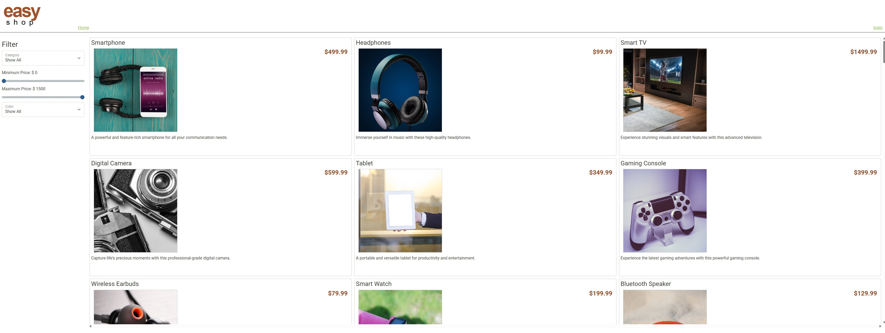
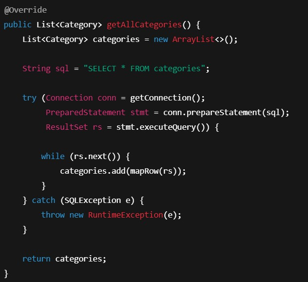

## EasyShop Overview

EasyShop is a Spring Boot REST API that powers a simple e-commerce application.  
This project was built as part of a backend capstone and focuses on correct API design, database interaction, filtering logic, and role-based access control.

## Application Capabilities

The application supports browsing products by category, filtering products by price and color, managing categories, and handling basic shopping cart functionality.

---

## ⚙️ Features

### Product Management
- Retrieve all products
- Filter products by:
    - Category
    - Minimum price
    - Maximum price
    - Color (stored as `subcategory`)
- Retrieve a single product by ID
- Admin-only product creation, update, and deletion

### Category Management
- Retrieve all categories
- Retrieve a category by ID
- Retrieve products by category
- Admin-only category creation, update, and deletion

### Authentication & Authorization
- Role-based access control using Spring Security
- Roles:
    - `ROLE_USER`
    - `ROLE_ADMIN`
- Admin-only endpoints protected with `@PreAuthorize`

---

## ️️🪲 Key Fixes & Improvements

This project involved identifying and fixing several backend issues, including:

## Full SQL queries and proper row mapping

## Result: DAOs now return real data, and controllers behave correctly. 

### ✅ Fixed Failing Tests & DAO Bugs
- Corrected DAO method implementations that previously returned `null`
- Ensured all DAOs properly map database rows to model objects
- Fixed incorrect method calls (e.g. `getAll()` vs `getAllCategories()`)

### ✅ Correct Product Filtering Logic
- Fixed SQL filtering logic for optional query parameters
- Ensured filters work correctly when parameters are omitted
- Added proper handling for empty string query parameters (converted to `null`)

### ✅ Color Filtering (Subcategory)
- Implemented correct filtering by `subcategory`
- Ensured color filtering works consistently across:
    - API requests
    - Frontend
    - Insomnia tests
- Confirmed visual image mismatch is due to seed data, not filtering logic

### ✅ REST Endpoint Stability
- Fixed missing controller annotations
- Added base request mappings
- Ensured all endpoints respond correctly with valid HTTP status codes

